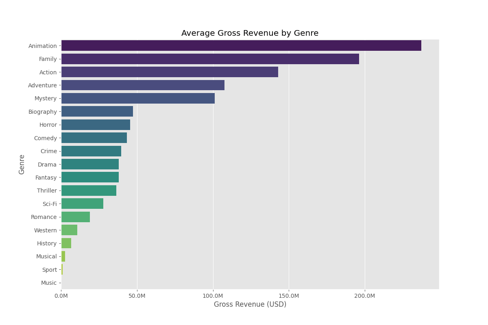
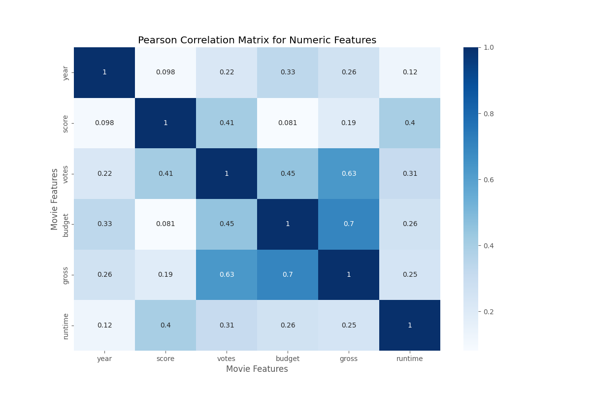

# correlatingmoviesproject
A data analysis project exploring correlations between movie attributes using Python and Pandas.

## Key Findings
- Budget and gross: ~0.7 Pearson correlation.
- Animation and Family genres lead earnings.

## Visualizations

## Notebook
[View Analysis](moviecorrelationproject.ipynb)
